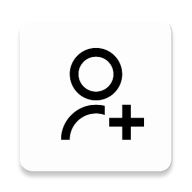
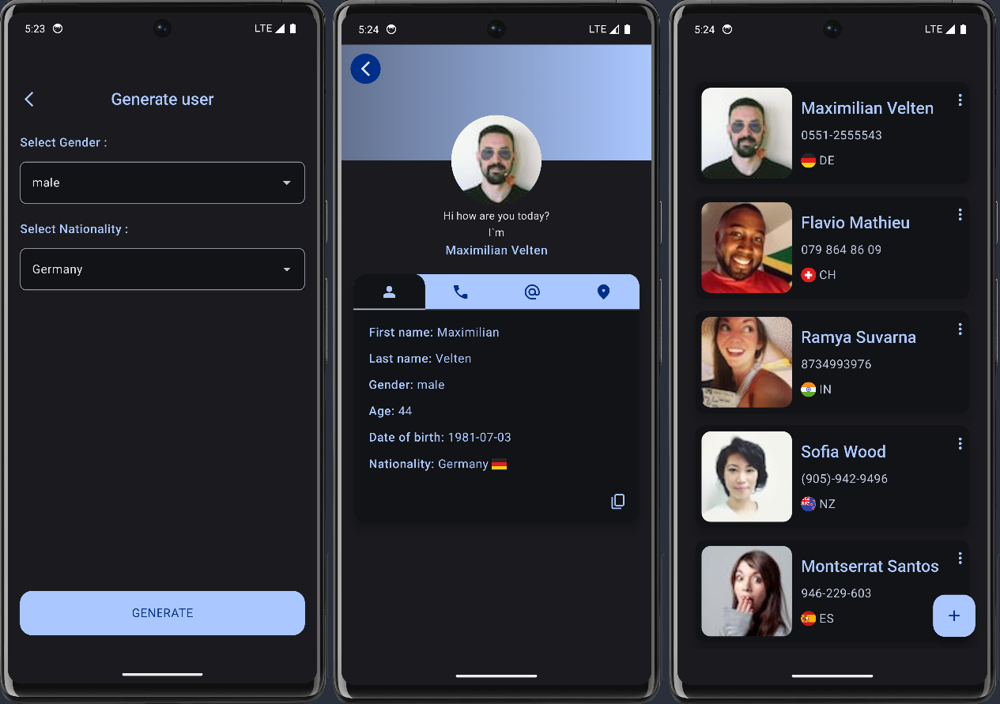

 

<h1 align="center">RandomUserApp</h1>

 
<h3 align="center">A simple Android app to generate and browse random users built with Kotlin and Jetpack Compose. It fetches data from the <a href="https://randomuser.me/">Random User API</a> and caches it locally with Room.</h3> 

 
  The app has three main screens: creation, list, and detailed user information. It uses Clean Architecture, MVI pattern, and the latest Navigation 3 library. 

 

## Features

- 🧩 User Creation & Listing: Create random users or view previously generated ones. Supports offline caching with Room.
- 💾 Offline Caching: All loaded users are stored locally so the app works without internet.
- 🎨 Dynamic Theming: Supports light and dark themes with Material3 expressive animations.
- 🧠 Detail Screen: Shows full user information including name, age, gender, nationality, and avatar.
- ✨ Selection & Copy: User info can be selected and copied.
- 🗑️ Undo Deletion: Removing a user can be undone with a snackbar action.

## Screenshots

## Demonstration

https://github.com/user-attachments/assets/69e1ac53-89b4-45bc-a9b7-a934a0db716c

